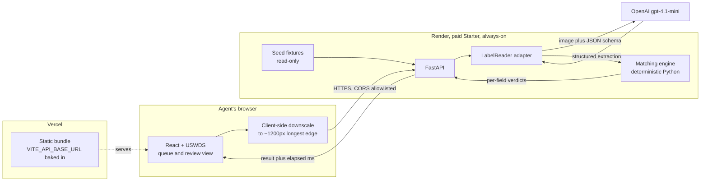
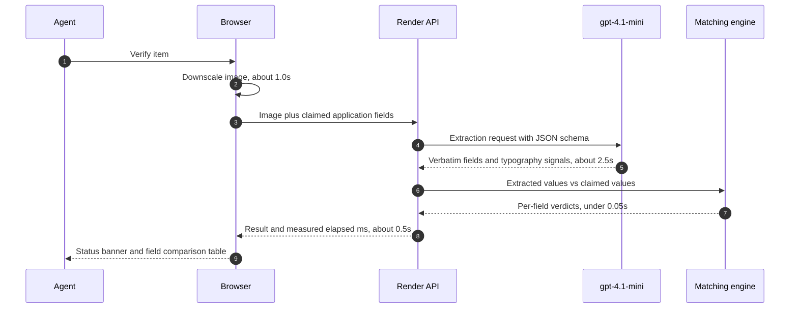
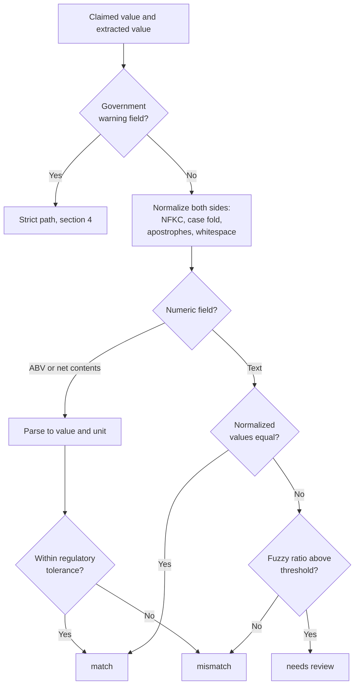
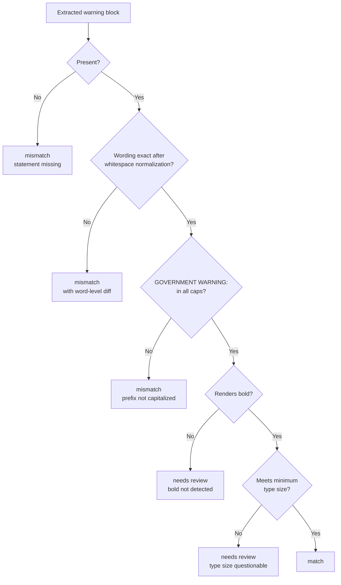
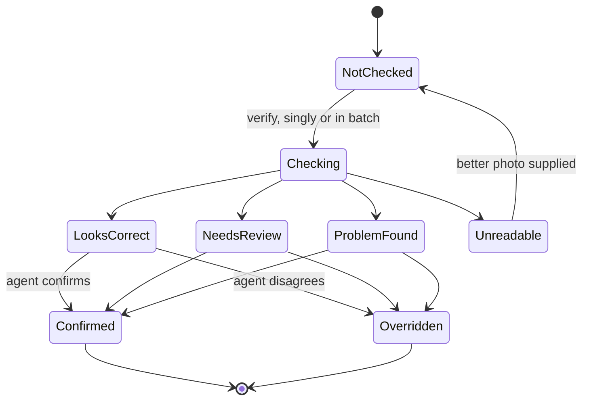
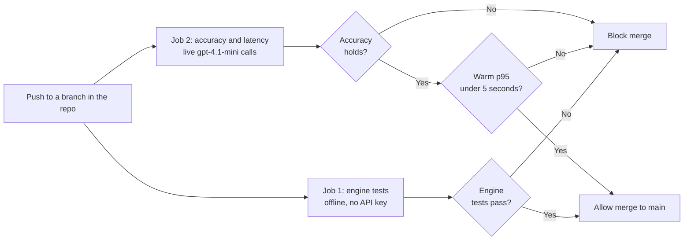

# Architecture and Decision Records

Structural view of the TTB label verification prototype, plus the decision
records behind it. The full reasoning and build plan live in
[approach.md](./approach.md); this document is the shape of the system and the
short form of why it is shaped that way.

---

## 1. System context

The key is held only by the backend. Review state is held only by the browser.
Nothing is persisted anywhere.

---

## 2. Verification pipeline and latency budget

The model is asked only what the label says. It is never asked whether the
label passes. Everything after step 6 is deterministic and testable offline.

---

## 3. Per-field matching logic

Normalization is what makes `STONE'S THROW` and `Stone's Throw` the same value
rather than a failure. Numeric fields never reach string comparison.

---

## 4. Government warning strict path

Wording and capitalization are hard failures. Bold and type size resolve to
`needs review` because visual weight cannot be judged reliably from a
photograph, and a false hard failure on a compliant label costs more trust than
it saves.

---

## 5. Queue item lifecycle

Every terminal state is reached by a human action, never by the system alone.
The reset control returns all items to `NotChecked` and discards confirms and
overrides.

---

## 6. CI gates

Job 2 requires `OPENAI_API_KEY` as a CI secret and therefore cannot run on pull
requests from forks.

---

## Decision records

Each record states the decision, the forces behind it, and what it costs.

### ADR-001: The model reads, the code judges

**Decision.** A single vision call performs structured extraction only. All
verdicts are computed in deterministic Python.

**Why.** The government warning requires word-for-word verification, and a
language model asked "is this exact?" produces agreeable paraphrase rather than
verification. Splitting the two also makes every verdict unit-testable with no
API calls, keeps one call in the latency path, and produces evidence the agent
can audit.

**Cost.** More code than handing both inputs to the model and asking for a
verdict. Extraction quality becomes the single upstream dependency, which
raises the importance of the fixture set.

### ADR-002: Provider access sits behind a LabelReader interface

**Decision.** All model access goes through one interface with an OpenAI
implementation and a deterministic mock.

**Why.** TTB's firewall blocks many outbound domains, which killed features in
the previous vendor pilot. A self-hosted vision model or on-premise OCR must be
substitutable without touching the matching engine. The mock also gives the
test suite and an offline demo path for free.

**Cost.** One indirection layer that a prototype does not strictly need.

### ADR-003: Three-state verdicts, and the agent always decides

**Decision.** Every item resolves to `match`, `needs review`, or `mismatch`,
and nothing is auto-approved or auto-rejected. The verdict sets triage
priority, not outcome.

**Why.** COLA approval is a legal action and this prototype has no authority
over the system of record. Label review also genuinely requires judgment. The
saving comes from replacing manual field extraction with a pre-filled,
evidence-backed comparison, not from removing the human.

**Cost.** Throughput gains are bounded by human review speed rather than
machine speed.

### ADR-004: The reviewer is the user, so the app opens on a seeded queue

**Decision.** The primary surface is a pre-populated review queue. Upload is an
action on that queue, not an entry point.

**Why.** Applications arrive from applicants through COLA; a reviewing agent
would never upload the batch they are about to review. An interface whose first
action is "upload a label" models the wrong person. Seeded fixture data stands
in for what COLA would deliver, which is different from building an integration
the requirements exclude.

**Cost.** Demo data must be built before any screen works, which moves fixtures
early in the build order.

### ADR-005: One field is strict, the rest are lenient

**Decision.** The government warning is compared exactly, with a word-level
diff on failure. Every other field normalizes and tolerates trivial variation.
Bold and type size grade to `needs review` rather than failing hard.

**Why.** The statutory text is fixed and any deviation is a real violation.
Brand names and addresses vary harmlessly in case, punctuation, and
abbreviation, and failing those would produce noise that trains agents to
ignore the tool.

**Cost.** Two distinct code paths and two sets of tests.

### ADR-006: No database

**Decision.** Stateless backend. Images are processed and discarded. Review
state lives in browser session state.

**Why.** Satisfies the no-PII-storage and sane-retention expectation as a
design property rather than a policy promise. It also gives per-evaluator
session isolation and a trivial reset with no server-side state to unwind.

**Cost.** Review progress does not survive a page reload, and override rates
cannot be measured across sessions. Both are acceptable for a prototype and are
noted as production gaps.

### ADR-007: Split deployment on an always-on backend

**Decision.** React on Vercel, FastAPI on Render's paid Starter instance.

**Why.** Render's free tier spins down after 15 minutes idle and takes about a
minute to wake, so a reviewer opening the deployed URL would meet a cold start
worse than the latency that killed the previous pilot. A paid instance removes
the failure mode instead of working around it with keep-warm pings.

**Cost.** A small monthly fee, two deploy targets, and CORS plus an API base
URL to configure across origins.

### ADR-008: One model, structured outputs

**Decision.** `gpt-4.1-mini` only, with Pydantic schemas enforced through
structured outputs.

**Why.** Fast, low cost, supports image input, and fits the latency budget.
Schema enforcement means the response conforms rather than being parsed
hopefully.

**Cost.** No fallback if extraction quality regresses. Prompt and schema design
become the only accuracy levers, which the evaluation script must therefore
guard.

### ADR-009: Latency is enforced, not asserted

**Decision.** Warm p95 across the fixture set must stay under 5 seconds, and
exceeding it blocks CI.

**Why.** A performance target that lives in a README drifts. The previous
pilot's failure was entirely a latency failure, so the requirement is treated
as binding.

**Cost.** CI needs a real API key and spends a small amount per run. Mitigated
by gating on p95 rather than max, reporting a per-stage breakdown on failure,
and never retrying automatically.

### ADR-010: USWDS through the React wrapper

**Decision.** `@trussworks/react-uswds` layered on `@uswds/uswds`, with USWDS
JavaScript and the Gulp pipeline left out.

**Why.** USWDS core is Sass and vanilla JS with no React components. The
wrapper supplies real components against the same design system and is in
federal production use. Section 508 and WCAG conformance arrive with the
system rather than as separate work, which directly serves the older,
non-technical user base.

**Cost.** Two packages whose versions must stay matched. Importing USWDS JS
alongside the wrapper causes double initialization, so it is deliberately
excluded.
