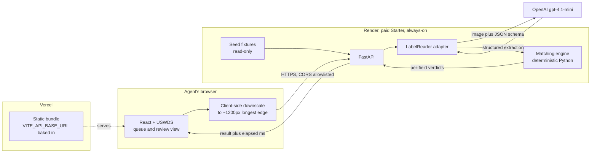
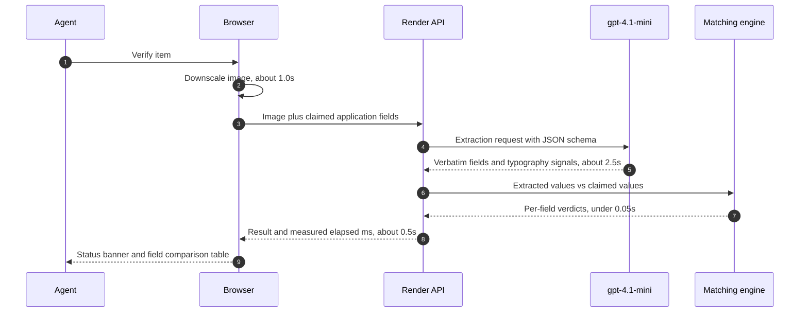
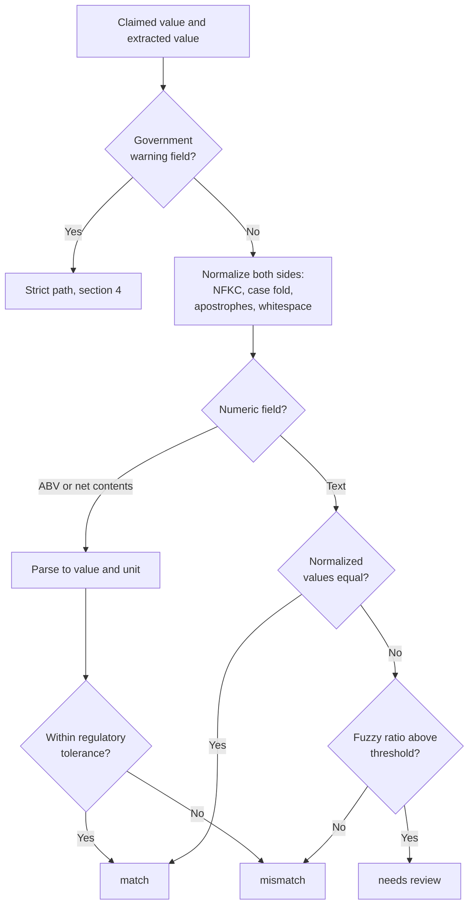
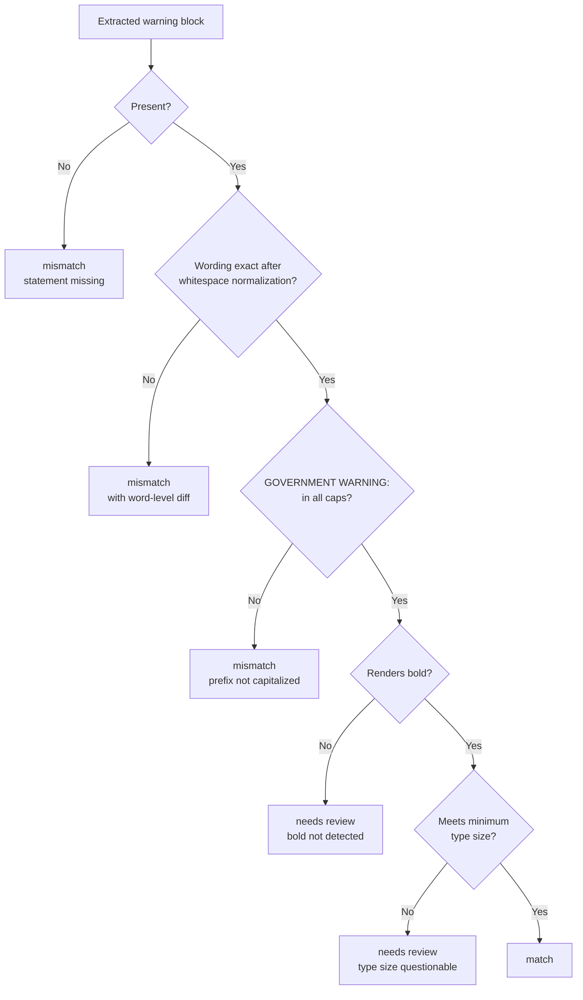
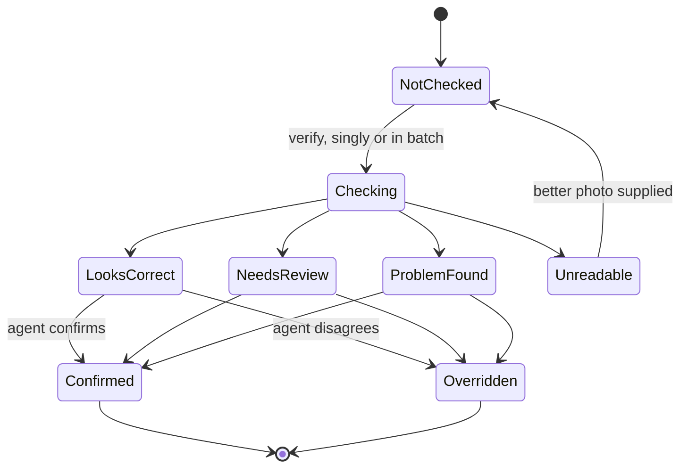
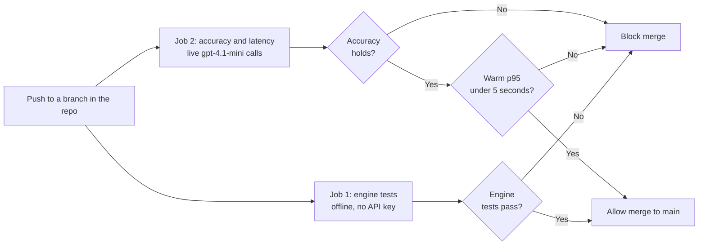

# Architecture and Decision Records

Structural view of the TTB label verification prototype, plus the decision
records behind it. The full reasoning and build plan live in
[approach.md](./approach.md); this document is the shape of the system and the
short form of why it is shaped that way.

---

## 1. System context

The key is held only by the backend. Review state is held only by the browser.
Nothing is persisted anywhere.

---

## 2. Verification pipeline and latency budget

The model is asked only what the label says. It is never asked whether the
label passes. Everything after step 6 is deterministic and testable offline.

---

## 3. Per-field matching logic

Normalization is what makes `STONE'S THROW` and `Stone's Throw` the same value
rather than a failure. Numeric fields never reach string comparison.

---

## 4. Government warning strict path

Wording and capitalization are hard failures. Bold and type size resolve to
`needs review` because visual weight cannot be judged reliably from a
photograph, and a false hard failure on a compliant label costs more trust than
it saves.

---

## 5. Queue item lifecycle

Every terminal state is reached by a human action, never by the system alone.
The reset control returns all items to `NotChecked` and discards confirms and
overrides.

---

## 6. CI gates

Job 2 requires `OPENAI_API_KEY` as a CI secret and therefore cannot run on pull
requests from forks.

---

## Decision records

Each record states the decision, the forces behind it, and what it costs.

### ADR-001: The model reads, the code judges

**Decision.** A single vision call performs structured extraction only. All
verdicts are computed in deterministic Python.

**Why.** The government warning requires word-for-word verification, and a
language model asked "is this exact?" produces agreeable paraphrase rather than
verification. Splitting the two also makes every verdict unit-testable with no
API calls, keeps one call in the latency path, and produces evidence the agent
can audit.

**Cost.** More code than handing both inputs to the model and asking for a
verdict. Extraction quality becomes the single upstream dependency, which
raises the importance of the fixture set.

### ADR-002: Provider access sits behind a LabelReader interface

**Decision.** All model access goes through one interface with an OpenAI
implementation and a deterministic mock.

**Why.** TTB's firewall blocks many outbound domains, which killed features in
the previous vendor pilot. A self-hosted vision model or on-premise OCR must be
substitutable without touching the matching engine. The mock also gives the
test suite and an offline demo path for free.

**Cost.** One indirection layer that a prototype does not strictly need.

### ADR-003: Three-state verdicts, and the agent always decides

**Decision.** Every item resolves to `match`, `needs review`, or `mismatch`,
and nothing is auto-approved or auto-rejected. The verdict sets triage
priority, not outcome.

**Why.** COLA approval is a legal action and this prototype has no authority
over the system of record. Label review also genuinely requires judgment. The
saving comes from replacing manual field extraction with a pre-filled,
evidence-backed comparison, not from removing the human.

**Cost.** Throughput gains are bounded by human review speed rather than
machine speed.

### ADR-004: The reviewer is the user, so the app opens on a seeded queue

**Decision.** The primary surface is a pre-populated review queue. Upload is an
action on that queue, not an entry point.

**Why.** Applications arrive from applicants through COLA; a reviewing agent
would never upload the batch they are about to review. An interface whose first
action is "upload a label" models the wrong person. Seeded fixture data stands
in for what COLA would deliver, which is different from building an integration
the requirements exclude.

**Cost.** Demo data must be built before any screen works, which moves fixtures
early in the build order.

### ADR-005: One field is strict, the rest are lenient

**Decision.** The government warning is compared exactly, with a word-level
diff on failure. Every other field normalizes and tolerates trivial variation.
Bold and type size grade to `needs review` rather than failing hard.

**Why.** The statutory text is fixed and any deviation is a real violation.
Brand names and addresses vary harmlessly in case, punctuation, and
abbreviation, and failing those would produce noise that trains agents to
ignore the tool.

**Cost.** Two distinct code paths and two sets of tests.

### ADR-006: No database

**Decision.** Stateless backend. Images are processed and discarded. Review
state lives in browser session state.

**Why.** Satisfies the no-PII-storage and sane-retention expectation as a
design property rather than a policy promise. It also gives per-evaluator
session isolation and a trivial reset with no server-side state to unwind.

**Cost.** Review progress does not survive a page reload, and override rates
cannot be measured across sessions. Both are acceptable for a prototype and are
noted as production gaps.

### ADR-007: Split deployment on an always-on backend

**Decision.** React on Vercel, FastAPI on Render's paid Starter instance.

**Why.** Render's free tier spins down after 15 minutes idle and takes about a
minute to wake, so a reviewer opening the deployed URL would meet a cold start
worse than the latency that killed the previous pilot. A paid instance removes
the failure mode instead of working around it with keep-warm pings.

**Cost.** A small monthly fee, two deploy targets, and CORS plus an API base
URL to configure across origins.

### ADR-008: One model, structured outputs

**Decision.** `gpt-4.1-mini` only, with Pydantic schemas enforced through
structured outputs.

**Why.** Fast, low cost, supports image input, and fits the latency budget.
Schema enforcement means the response conforms rather than being parsed
hopefully.

**Cost.** No fallback if extraction quality regresses. Prompt and schema design
become the only accuracy levers, which the evaluation script must therefore
guard.

### ADR-009: Latency is enforced, not asserted

**Decision.** Warm p95 across the fixture set must stay under 5 seconds, and
exceeding it blocks CI.

**Why.** A performance target that lives in a README drifts. The previous
pilot's failure was entirely a latency failure, so the requirement is treated
as binding.

**Cost.** CI needs a real API key and spends a small amount per run. Mitigated
by gating on p95 rather than max, reporting a per-stage breakdown on failure,
and never retrying automatically.

**Revisited after phase 4.** The threshold in this decision is not currently
achievable. Measured warm p95 for the extraction call alone is 20.4 seconds, and
p50 sits between 5 and 7. A gate written as specified would fail every build,
including correct ones, which is the precise failure mode this ADR exists to
avoid. The gate is still built in phase 8 and still blocks on regression, but the
absolute threshold has to be set from the deployed measurement rather than from
the figure in the brief. See approach.md section 6, "Measured, phase 4".

### ADR-010: USWDS through the React wrapper

**Decision.** `@trussworks/react-uswds` layered on `@uswds/uswds`, with USWDS
JavaScript and the Gulp pipeline left out.

**Why.** USWDS core is Sass and vanilla JS with no React components. The
wrapper supplies real components against the same design system and is in
federal production use. Section 508 and WCAG conformance arrive with the
system rather than as separate work, which directly serves the older,
non-technical user base.

**Cost.** Two packages whose versions must stay matched. Importing USWDS JS
alongside the wrapper causes double initialization, so it is deliberately
excluded.

### ADR-011: The model observes, the reader converts

**Decision.** The model is asked for a dimensionless cap-height ratio rather
than a millimetre type size, and is not asked whether the warning prefix is
capitalized at all. A wire schema in `app/readers/schema.py` holds what is
actually requested, and the reader maps it onto the `WarningBlock` contract.

**Why.** Both changes come from phase 4 measurement rather than from taste.

Asked for `estimated_type_size_mm`, `gpt-4.1-mini` returned null on a label
whose type size is known to be 2.2mm. It sees pixels and has no reference
object in frame, so a millimetre figure is a conversion it cannot ground. A
ratio is something it can genuinely observe, and the conversion to millimetres
is arithmetic that belongs in code.

Asked for `prefix_is_caps`, it returned true on a label whose warning it had
just transcribed correctly in title case, turning a real violation into a clean
pass. The transcription was faithful and the signal about the transcription was
not, so the signal is no longer requested. `app.matching.warning` already
carried a fallback deriving capitalization from the verbatim text, and that
fallback is now the only path.

This is ADR-001 applied one level down. The split is not merely "the model does
not decide verdicts"; it is that the model is asked only for things it can
observe, and everything derivable is derived.

**Cost.** A second set of models to keep in step with the contract, and a
mapping layer that could drift from it. Bought back by letting the wire schema
be tuned for the model without the engine, the manifest, or the expected
verdicts moving at all, which is what made both fixes cheap.

### ADR-012: Extraction failures are not unreadable labels

**Decision.** A timeout, a transport error, a refusal, or a truncated
generation raises `ExtractionError` and surfaces as HTTP 502. Only the model
reporting that it cannot read the image produces the `unreadable` outcome, and
that returns 200.

**Why.** They look similar in a UI and mean opposite things. "Request a better
photograph" is an instruction to the agent that is actionable and correct when
the image is genuinely bad, and actively misleading when the provider is down.
Collapsing the two would send agents chasing photographs during an outage, and
would hide the outage from the only signal that would reveal it.

**Cost.** Callers must handle a failure path distinct from the result path,
including in batch, where phase 7 has to keep one failed item from reading as a
compliance finding.

### ADR-013: The queue order freezes while a batch runs

**Decision.** During a batch, the grid keeps the order it had when the run
started. Per-item results still land on their cards the moment they arrive, and
a live counter reports how many problems have surfaced so far. The
attention-needed sort is applied when the run finishes, or earlier if the agent
presses "Sort by attention needed". This revises approach.md section 5.7, which
originally promised a live re-sort on every arriving result.

**Why.** With two hundred items in flight, a verdict lands every second or two,
and each one would move cards under the agent's pointer and under a keyboard
user's focus. A control that moves while being reached for is an accessibility
failure before it is an annoyance. Problems still surface early, through the
counter and the on-demand sort, rather than through motion.

**Cost.** The screen holds a display order alongside the derived sort and must
reconcile them at the end of a run. And the design in 5.7 as written was not
built, which this record exists to say plainly.

### ADR-014: Added labels never touch the server

**Decision.** The add-labels path parses the CSV, validates every row, and
builds queue items entirely in the browser. Images are held as `File` objects
with object-URL thumbnails, and are posted to the same `POST /api/verify` as
seeded fixtures at verification time. There is no upload endpoint and no
server-side ingestion state.

**Why.** ADR-006 rejected a database; an upload endpoint would have
reintroduced one in disguise, as server state that outlives a request and must
be reset per evaluator. Client-held files keep every evaluator's queue isolated
for free, and the verify endpoint already accepts arbitrary images, so the
server needed no change at all.

**Cost.** Added labels do not survive a page reload, and the browser holds the
image bytes for the life of the session, which is why the reset path revokes
their object URLs. Both are prototype-shaped costs; a production ingestion is a
different system and is recorded as such in approach.md section 5.7.
