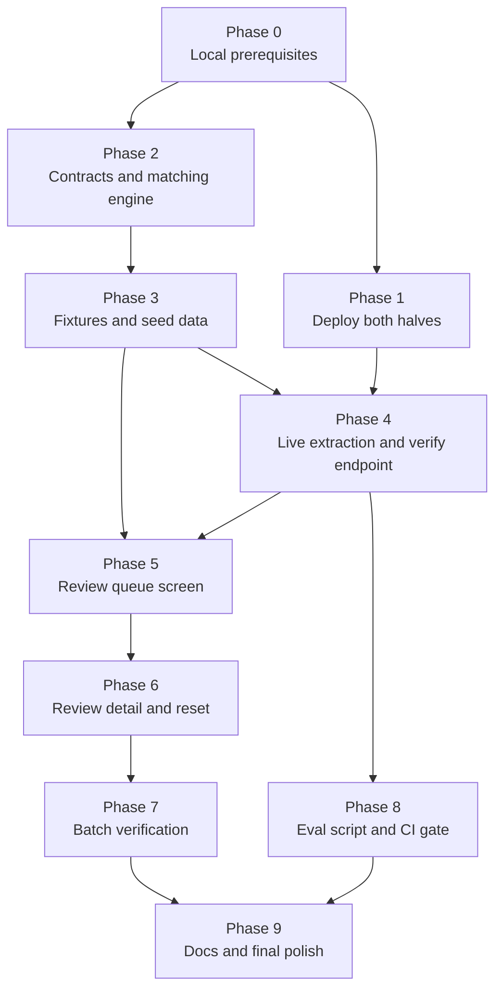

# Build Action Plan

Ordered, executable plan from the current scaffold to a finished submission.
Each phase states its goal, its tasks, and an explicit done-when so progress is
verifiable rather than felt.

Design rationale lives in [approach.md](./approach.md); structure and decision
records live in [architecture.md](./architecture.md). This document is the
sequence of work.

---

## Where the scaffold already is

Commit `7c3836a` delivers a working end-to-end skeleton:

| Piece | State |
| --- | --- |
| Backend | FastAPI, `uv`, Python 3.12, CORS middleware, `/api/health` |
| Config | `pydantic-settings` reading a single root `.env`; `load_dotenv` exports `OPENAI_API_KEY` under the SDK's default name |
| Frontend | Vite, React 19, `@trussworks/react-uswds` 12.0.0 on `@uswds/uswds` 3.13.0 |
| Styling | Compiled USWDS CSS plus wrapper CSS imported; USWDS JS deliberately excluded per ADR-010 |
| Health path | `App.tsx` calls `/api/health` and renders a USWDS Alert either way |
| Tests | `pytest` on the health route; `ruff` configured |
| CI | Backend job (ruff, pytest) and frontend job (lint, build); latency gate stubbed as a TODO |
| Render | `render.yaml` blueprint written, Starter plan, secrets marked `sync: false`. Not yet deployed. |
| Vercel | Nothing configured yet |

So phase 1 of the build order in approach.md section 8 is half complete: the
scaffold exists, the deployment does not.

---

## Phase dependencies

Phase 2 does not wait on Phase 1. The matching engine is offline work and can
proceed while deployment settles.

---

## Phase 0: Local prerequisites

**Goal.** A developer can run both halves locally and see the health check pass.

There is currently no `.env` at the repo root, so the backend has no API key.

**Tasks**

1. Copy `.env.example` to `.env` and fill in `OPENAI_API_KEY`. Leave the other
   defaults alone for local work.
2. Backend: `cd backend && uv sync && uv run uvicorn app.main:app --reload`
3. Frontend: `cd frontend && npm install && npm run dev`

**Done when.** `http://localhost:5173` shows the green "Backend connected"
alert reporting `gpt-4.1-mini`.

**Note.** Running the Vite dev server from WSL against a `/mnt/c` path does not
reliably pick up file changes made from Windows. If hot reload serves stale
modules, restart with `npm run dev -- --force` or enable
`server.watch.usePolling` in `vite.config.ts`.

---

## Phase 1: Deploy both halves early

**Goal.** A public URL serving the frontend, talking to a live backend, with
the health check green in production. No application logic required.

This phase is deliberately separate and deliberately early. Deployment is the
single highest-variance task in the project and the one most likely to consume
a day at the worst possible moment. Proving the full path now means every later
phase ships onto infrastructure already known to work.

**Tasks**

1. **Render.** Create the service from the existing `render.yaml` blueprint.
   Confirm the Starter plan is selected, not free, per ADR-007. Set
   `OPENAI_API_KEY` and `ALLOWED_ORIGINS` in the dashboard, since both are
   marked `sync: false` and must never enter the repo.
2. **Vercel.** Import the repo and set **Root Directory to `frontend`**. There
   is no `vercel.json`, so this is configured in project settings or added as
   one. Set `VITE_API_BASE_URL` to the Render service URL. It is read at build
   time, so changing it later requires a redeploy, not just a restart.
3. **Close the CORS loop.** Set `ALLOWED_ORIGINS` on Render to the Vercel
   production domain and redeploy the backend.
4. **Verify in production**, not locally: open the Vercel URL and confirm the
   success alert renders with the model name.
5. **Time a cold request** and confirm it is not paying a spin-up penalty,
   which validates that the Starter plan is actually in effect.

**Done when**

| Check | Passing looks like |
| --- | --- |
| Render health | `GET https://<render-url>/api/health` returns `{"status":"ok","model":"gpt-4.1-mini"}` |
| Vercel build | Frontend builds with `frontend` as root directory |
| Cross-origin call | Vercel URL shows the green alert, no CORS error in console |
| No cold start | A request after several idle minutes returns promptly |

**Known snag: Vercel preview deployments.** Preview URLs are generated per
deployment, so a static `ALLOWED_ORIGINS` list cannot cover them and previews
will fail CORS while production works. Two options: accept that only production
talks to the backend during the prototype, or switch the middleware to
`allow_origin_regex` matching the Vercel preview domain pattern. Decide here
rather than being surprised later, and record the choice in the README.

---

## Phase 2: Extraction contract and matching engine

**Goal.** The deterministic core, fully tested, with no network calls.

This is the highest-value code in the project and it is entirely offline, which
means it is fast to iterate and fast to test.

**Tasks**

1. Pydantic models for the extraction contract: per-field verbatim text plus
   confidence, the warning block with its caps, bold, and relative size
   signals, and an overall readability assessment with a reason code.
2. Normalization utilities: NFKC, case folding, whitespace collapse, quote and
   apostrophe normalization.
3. Per-field comparators returning `match` / `needs review` / `mismatch`, each
   with a plain-English reason string.
4. Numeric parsing for alcohol content and net contents, with unit
   normalization and regulatory tolerance bands. Confirm the actual tolerance
   values against 27 CFR while implementing rather than guessing.
5. The government warning strict path: whitespace-normalized exact comparison
   against the canonical statutory text, producing a word-level diff on
   failure, plus caps, bold, and type size checks graded per ADR-005.
6. `LabelReader` interface with the deterministic mock implementation only.
   The OpenAI implementation comes in Phase 4.
7. pytest coverage for every comparator, including the `STONE'S THROW` case,
   proof versus ABV consistency, and each government warning failure mode.

**Done when.** `uv run pytest` passes with every field strategy covered, and
the whole suite runs without an API key present.

---

## Phase 3: Fixtures and seed data

**Goal.** The label images and paired application records that seed the demo
queue, back the tests, and form the evaluation set.

**Tasks**

1. Generate roughly 15 labels covering each failure mode: clean pass, case
   variance, ABV mismatch, title-case warning, altered warning wording, missing
   warning, undersized warning type, missing country of origin on an import,
   and unreadable images (glare, blur, angle).
2. Generate about 20 straightforward passing labels so the seeded queue has
   realistic proportions. A queue where half the items are violations
   misrepresents the job.
3. Write the paired application record for each label, plus the expected
   verdict per field, which is what makes this an evaluation set rather than
   just sample data.
4. Ship a thumbnail per fixture so the queue does not download full images.
5. Expose a read-only endpoint that serves the seed queue.

**Done when.** The endpoint returns the full seeded queue with thumbnails, and
every fixture has a recorded expected verdict.

---

## Phase 4: Live extraction and the verify endpoint

**Goal.** Real verification against `gpt-4.1-mini`, measured.

**Tasks**

1. OpenAI implementation of `LabelReader` using structured outputs bound to the
   Phase 2 Pydantic schema.
2. Prompt engineering for verbatim extraction. The model reports what the label
   says; it never judges.
3. `POST /api/verify` accepting an image plus claimed application fields,
   returning per-field verdicts and measured elapsed milliseconds.
4. Server-side stage timing: upload, model call, matching, total.
5. Unreadable handling as a distinct outcome, never a low-confidence guess.
6. Client-side downscale to roughly 1200px on the longest edge before upload.

**Done when.** A fixture label verifies end to end against the live model in
under 5 seconds warm, with the per-stage breakdown present in the response.

---

## Phase 5: Review queue screen

**Goal.** The primary surface: an agent opens the app and sees work waiting.

**Tasks**

1. Queue grid of thumbnail cards showing brand name, application reference, and
   status badge across the six states.
2. Sort by attention needed: problems, then review, then clean, then unchecked.
3. Load seeded items in the `not yet checked` state. Do not pre-compute
   verdicts; the demo must show verification actually running.
4. Wire single-item verification with a visible in-flight state.
5. USWDS layout throughout, with the type scale and target sizes left large.

**Done when.** The deployed URL opens on a populated queue, and verifying one
item flips its card to a real verdict.

---

## Phase 6: Review detail, confirm/override, and reset

**Goal.** The agent can actually work an item and finish it.

**Tasks**

1. Review view: status banner, three-column comparison table with
   plain-English reasons, label image alongside.
2. Word-level diff rendering for government warning failures.
3. Confirm and override controls, with override captured as the accuracy
   signal.
4. Next and previous navigation through the queue without returning to it.
5. Reset control restoring the seeded state, placed away from the working
   actions, confirming only when there is review work to lose.

**Done when.** An agent can open an item, read why each field passed or failed,
record a decision, move to the next, and reset the whole demo to run again.

---

## Phase 7: Batch verification

**Goal.** The 200 to 300 item scenario.

**Tasks**

1. Multi-select on the queue plus a verify-all-unchecked action.
2. Bounded concurrency, roughly 5 to 8 parallel calls.
3. Per-item progress streamed so cards resolve individually and the queue
   re-sorts as results arrive.
4. Bulk confirm for clean matches.
5. CSV export including agent overrides.
6. Add-labels ingestion: images plus a CSV of application rows matched by
   filename.

**Done when.** A batch of 200-plus items processes with visible per-item
progress, problems surface while the rest is still running, and results export
cleanly.

---

## Phase 8: Evaluation script and the CI latency gate

**Goal.** Turn the accuracy and latency claims into something enforced.

**Tasks**

1. Evaluation script scoring the engine against the Phase 3 expected verdicts,
   reporting per-field accuracy plus p50 and p95 latency.
2. Per-stage breakdown in the failure output so a red build is diagnosable in
   seconds.
3. Fill in the existing `TODO` job in `.github/workflows/ci.yml`: real
   `gpt-4.1-mini` calls, `OPENAI_API_KEY` from repo secrets, blocking on
   accuracy regression or warm p95 above 5 seconds. No automatic retries.
4. Mark the job required for merge into `main`.

**Done when.** CI blocks a deliberately slowed or broken build, and passes a
healthy one.

---

## Phase 9: Documentation and final polish

**Goal.** The submission reads as finished.

**Tasks**

1. README: what it does, setup and run instructions, the deployed URL, measured
   p50 and p95, and the accuracy numbers from Phase 8.
2. Record the trade-offs explicitly: no database, in-process queue, seeded
   fixtures standing in for COLA, soft bold grading, cloud model with the
   self-hosting path behind `LabelReader`.
3. State the firewall constraint and the `LabelReader` swap-out as the
   production answer.
4. Note the Starter plan as a deliberate choice serving the latency
   requirement.
5. Error and empty states: unreadable images, backend unreachable, malformed
   CSV, unsupported file type.
6. Accessibility pass: keyboard navigation through the queue, focus management
   in the review view, and confirmation that status is never conveyed by color
   alone.

**Done when.** A reviewer can clone, follow the README, run it locally, open
the deployed URL, and understand every trade-off without asking a question.

---

## Sequencing notes

- **Phases 1 and 2 can run in parallel.** Deployment is mostly waiting on
  dashboards; the matching engine is local work.
- **Phase 3 gates most of the UI.** Fixtures come before screens because every
  screen needs them to exist. This is the one place the plan refines the build
  order in approach.md section 8, which listed the engine before fixtures.
- **Stretch items stay out** until Phase 9 is done: glare and skew
  preprocessing, and anything else not already named here. The evaluation
  criteria state plainly that a working core beats an ambitious but incomplete
  submission.
